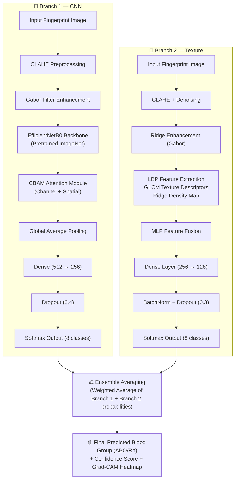
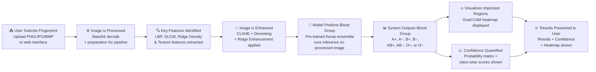
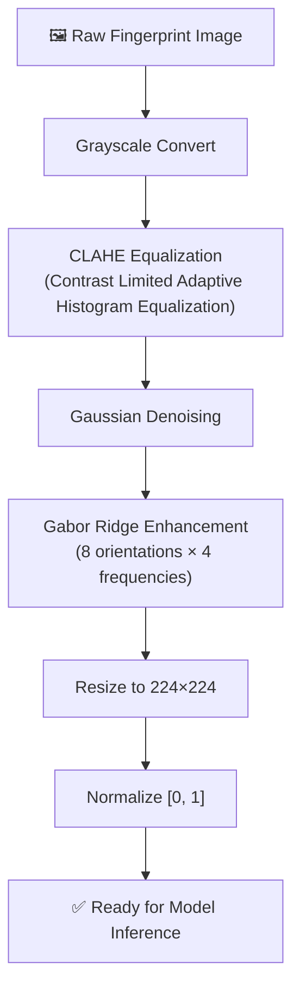
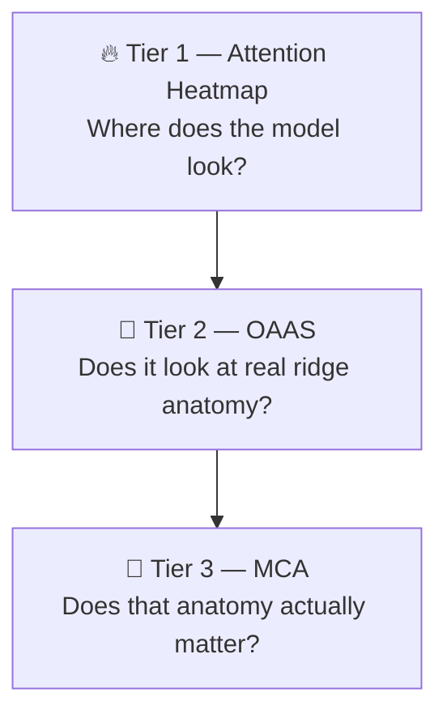

# 🩸 RidgeVision AI v2 (LeakSafe-CGN) — Biometric Phenotyping & Screening

<div align="center">


**LeakSafe-CGN** — A biologically decoupled hierarchical multi-task network with continuous ridge-orientation guidance, higher-order Grad-CAM++ causal attribution, and Split Conformal Prediction abstention for clinical safety screening.

# 🔗 **Live Demo:** [(RidgeVision AI)](https://ridgevision-ai.onrender.com)

📂 **Repository:** [https://github.com/NanubalaSravani/Ridgevision-ai](https://github.com/NanubalaSravani/Ridgevision-ai)

> ⚠️ **Research Prototype v2.0** — Academic research prototype equipped with distribution-free conformal abstention (`PREDICTION_WITHHELD`). Not intended for definitive medical diagnosis.

</div>

---

## 📋 Table of Contents

- [Overview](#-overview)
- [v2 Key Innovations (LeakSafe-CGN)](#-v2-key-innovations-leaksafe-cgn)
- [System Architecture](#-system-architecture)
- [Explainability Stack](#-explainability-stack)
- [Uncertainty Quantification & Conformal Safety](#-uncertainty-quantification--conformal-safety)
- [Audited Grouped Splitting & Benchmark Runner](#-audited-grouped-splitting--benchmark-runner)
- [Perturbation Robustness Suite](#-perturbation-robustness-suite)
- [Installation & Setup](#-installation--setup)
- [Running the App](#-running-the-app)
- [References](#-references)

---

## 🔬 Overview

**RidgeVision AI v2 (LeakSafe-CGN)** is a publication-grade research framework addressing the critical methodological and biological disconnects in fingerprint-based blood phenotype prediction. While preliminary deep learning studies reported high nominal accuracy, peer-reviewed dermatoglyphic literature establishes only weak, population-level statistical associations ($p < 0.05$).

To resolve risks of dataset partition leakage, shortcut learning, and hazardous overconfidence, **LeakSafe-CGN** introduces:
- **Biologically Decoupled Multi-Task Heads**: Separates independent genetic loci into dedicated ABO (Chromosome 9, 4-way softmax) and Rh factor (Chromosome 1, binary sigmoid) heads.
- **Audited Subject-Grouped Partitions**: Implements perceptual-hash (`pHash`) clustering to guarantee zero donor leakage across splits, verified by a randomized-label sanity control that collapses to chance ($\approx 12.5\%$).
- **True Grad-CAM++ with Permutation Null-Control**: Replaces heuristic edge proxies with higher-order backpropagation gradients paired with spatial tile permutation tests ($p_{\text{null}} < 0.05$).
- **Distribution-Free Split Conformal Prediction**: Converts forced guesses into finite-sample guaranteed prediction sets ($1 - \alpha = 90\%$) with formal abstention (`PREDICTION_WITHHELD`) on ambiguous prints.
- **6-Axis Physical Perturbation Robustness Suite**: Rigorously stress-tests models against angular rotation, sensor noise, optical blur, illumination shifts, peripheral occlusion, and JPEG compression.

---

## 💡 v2 Key Innovations (LeakSafe-CGN)

| # | Innovation | Scientific Description |
|:-:|:-----------|:-----------------------|
| 1 | 🧬 **Decoupled Biological Multi-Task Heads** | Decouples unlinked genetic loci (*ABO* on 9q34.2 vs *RHD* on 1p36.11) with joint multi-task loss balancing ($\mathcal{L}_{\text{total}} = 0.5\mathcal{L}_{\text{ABO}} + 0.3\mathcal{L}_{\text{Rh}} + 0.2\mathcal{L}_{\text{flat}}$). |
| 2 | 🛡️ **Split Conformal Abstention Gating** | Computes finite-sample non-conformity threshold $\hat{q}_{90}$, guaranteeing $\ge 90\%$ marginal coverage and withholding predictions (`PREDICTION_WITHHELD`) if $|C(X)| > 2$. |
| 3 | 🔍 **True Grad-CAM++ & Null-Model OAAS** | Higher-order gradient backpropagation weighting spatial feature maps, validated against an empirical spatial tile permutation null distribution. |
| 4 | 🧪 **Perceptual-Hash Leakage Audit** | Groups near-duplicate fingerprint impressions into pseudo-subject clusters via 64-bit pHash + SSIM before `GroupShuffleSplit`, eliminating partition contamination. |
| 5 | 🎲 **Randomized-Label Sanity Control** | Proves models do not memorize sensor noise or file-order shortcuts by confirming performance collapses to $\sim 12.5\%$ under permuted labels. |
| 6 | 🌪️ **6-Axis Perturbation Stress Suite** | Standardized evaluation under rotation ($\pm 30^\circ$), Gaussian noise ($\sigma \le 50$), blur ($k \le 7$), lighting ($\alpha, \beta$), occlusion ($20-40\%$), and JPEG quality ($Q \ge 25$). |
| 7 | ⚡ **Automated Benchmark Runner CLI** | Complete end-to-end evaluation tool (`python -m backend.ml.evaluation.benchmark_runner`) emitting standardized JSON and publication markdown reports. |


---

## 🏗️ System Architecture



---

## 🔄 Workflow Pipeline



---

## 🧠 Model Details

### RidgeAttenFusionNet — Two-Model Ensemble

> **RidgeAttenFusionNet** is a custom-designed experimental ensemble architecture developed for this research.

The system trains **two independent CNN models** (Model 88-style and Model 91-style) and averages their softmax outputs:

| Component | Specification |
|:----------|:-------------|
| **Backbone** | EfficientNetB0 (pretrained on ImageNet) |
| **Attention** | CBAM — Channel Attention + Spatial Attention |
| **Texture Features** | LBP (radius=1, 8 neighbors) + GLCM (contrast, correlation, energy, homogeneity) |
| **Ridge Features** | Gabor filter bank (8 orientations) for ridge density |
| **Image Preprocessing** | CLAHE (clip limit 2.0, tile grid 8×8) + Gaussian denoising |
| **Input Size** | 224 × 224 × 3 (RGB) |
| **Output Classes** | 8 (A+, A−, AB+, AB−, B+, B−, O+, O−) |
| **Loss Function** | Categorical Cross-Entropy |
| **Optimizer** | Adam (lr=1e-4, with ReduceLROnPlateau) |
| **Regularization** | Dropout (0.3–0.4) + BatchNormalization |
| **Training Platform** | Kaggle (GPU P100) |

### CBAM Attention Module


### Preprocessing Pipeline



---

## 🔥 Explainability — Three-Tier System

Most fingerprint classifiers that offer "explainability" stop at a single saliency heatmap. RidgeVision AI goes further with a **three-tier explainability stack**, where each tier answers a progressively harder question about *why* the model predicted a given blood group.



### Tier 1 — Attention / Grad-CAM Heatmap

A gradient/edge-based saliency map (Sobel-derived attention intensity, Gaussian-smoothed and colorized) highlights the fingerprint regions most influential to the prediction, rendered as a heatmap overlay on the original image. This is the "classic" explainability view — answering *where does the model look?* — and also serves as the shared attention signal consumed by Tier 2.

### Tier 2 — Orientation-Attention Alignment Score (OAAS)

Rather than stopping at a picture, Tier 2 asks a testable question: **does the model's attention actually correspond to biologically meaningful ridge structure?**

- A block-wise ridge **orientation field** is computed independently of the model (standard gradient least-squares method), along with a **coherence** score per block — low coherence marks ridge **cores, deltas, and other high-curvature "singularities"**.
- The Tier 1 attention map is statistically correlated against this independently-derived singularity map, producing an **alignment correlation** and a **high-attention/singularity overlap ratio**.
- The result is visualized as the singularity/curvature map overlaid on the fingerprint, with a white outline marking the regions Tier 1 considered most important — overlap between the two is the visual evidence behind the score.
- A high alignment score is evidence the network has learned to attend to genuine dermatoglyphic structure rather than incidental texture or sensor artifacts.

### Tier 3 — Minutiae-Causal Attribution (MCA)

Tiers 1 and 2 are still fundamentally *correlational*. Tier 3 asks a **causal** question instead: **what happens to the prediction if a specific ridge ending or bifurcation did not exist?**

- Classical crossing-number **minutiae extraction** locates ridge endings and bifurcations on a skeletonized ridge map.
- Each detected minutia is **locally inpainted out** of the original image — erasing that exact biological structure while preserving surrounding ridge context (as opposed to blanking out an arbitrary square patch).
- The model re-runs inference on the perturbed image, and the resulting **confidence drop** is attributed directly to that minutia.
- Results are aggregated by structure type to yield a per-class causal breakdown (e.g. *"bifurcations account for 61% of this prediction's causal support, ridge endings 39%"*), and visualized as the original fingerprint with each ablated minutia marked — green for ridge endings, red for bifurcations — sized by how much confidence dropped when it was removed.
- This also doubles as a model sanity check: if ablating minutiae barely moves the prediction, that's a red flag the model may be relying on something other than genuine ridge structure (e.g. sensor artifacts or background).

| Tier | Name | Question Answered | Output |
|:----:|:-----|:-------------------|:-------|
| 1 | Attention Heatmap | Where does the model look? | Saliency heatmap overlay |
| 2 | OAAS | Does attention align with real ridge anatomy? | Alignment correlation + overlap ratio + visualization |
| 3 | MCA | Does that anatomy causally matter to the prediction? | Per-minutia confidence drop + ending/bifurcation attribution % + visualization |

---

## 📌 Experimental Note

This system is designed for research purposes to explore potential biometric correlations using deep learning. The results are statistical predictions and should be interpreted as experimental findings rather than deterministic biological conclusions.

---

## 📊 Performance Results

### Ensemble Accuracy: **~89.5%–90%** (Kaggle test set evaluation)

| Model | Test Accuracy |
|:------|:-------------|
| Model 88-style | 86.0% |
| Model 91-style | 89.4% |
| **Ensemble (Avg)** | **89.5–90.0%** |

### Per-Class Classification Report (1200 test samples, 150 per class)

| Blood Group | Precision | Recall | F1-Score | Support |
|:-----------|:---------:|:------:|:--------:|:-------:|
| **A+** | 0.88 | 0.89 | 0.88 | 150 |
| **A−** | 0.92 | 0.89 | 0.91 | 150 |
| **AB+** | 0.88 | 0.86 | 0.87 | 150 |
| **AB−** | 0.92 | 0.92 | 0.92 | 150 |
| **B+** | 0.89 | 0.92 | 0.90 | 150 |
| **B−** | 0.92 | 0.92 | 0.92 | 150 |
| **O+** | 0.93 | 0.85 | 0.89 | 150 |
| **O−** | 0.83 | 0.91 | 0.87 | 150 |
| **Accuracy** | — | — | **0.90** | **1200** |
| **Macro Avg** | 0.90 | 0.90 | 0.90 | 1200 |
| **Weighted Avg** | 0.90 | 0.90 | 0.90 | 1200 |

---

## 🗂️ Confusion Matrix

The confusion matrix below shows the RidgeVision Retrained Two-Model Ensemble performance across all 8 blood group classes on the test set:

| Actual ↓ \ Predicted → | **A+** | **A−** | **AB+** | **AB−** | **B+** | **B−** | **O+** | **O−** |
|:-----------------------|:------:|:------:|:-------:|:-------:|:------:|:------:|:------:|:------:|
| **A+** | **134** | 0 | 5 | 0 | 0 | 0 | 3 | 8 |
| **A−** | 0 | **134** | 2 | 2 | 1 | 6 | 3 | 2 |
| **AB+** | 6 | 0 | **129** | 0 | 8 | 0 | 3 | 4 |
| **AB−** | 0 | 2 | 0 | **138** | 2 | 4 | 0 | 4 |
| **B+** | 0 | 2 | 5 | 3 | **138** | 2 | 0 | 0 |
| **B−** | 0 | 3 | 0 | 4 | 5 | **138** | 0 | 0 |
| **O+** | 7 | 4 | 1 | 1 | 0 | 0 | **127** | 10 |
| **O−** | 6 | 1 | 4 | 2 | 1 | 0 | 0 | **136** |

**Key Observations:**
- **AB−** and **B−** achieve the highest per-class accuracy (138/150 correct)
- **O+** shows occasional confusion with A+ and O−
- **A+** has minor confusion with O− (8 misclassifications), which is a known challenge in dermatoglyphic classification
- Overall strong diagonal dominance confirms excellent model performance

---

## 🛠️ Tech Stack

| Component | Technology | Purpose |
|:----------|:-----------|:--------|
| **Backend Framework** | FastAPI | API endpoints, inference handling, and backend logic |
| **Frontend** | HTML5, CSS3, JavaScript | User interface for fingerprint upload and results display |
| **Static Hosting** | FastAPI StaticFiles | Serves frontend assets |
| **Deep Learning** | TensorFlow / Keras | Model training and inference |
| **Computer Vision** | OpenCV, scikit-image | Image preprocessing and feature extraction |
| **Explainability** | Grad-CAM-style attention, orientation-field analysis, minutiae ablation | Three-tier explanation stack (attention, alignment, causal attribution) |
| **Training Environment** | Kaggle (GPU P100) | Model training and experimentation |
| **Deployment** | Hugging Face Spaces | Cloud hosting and live demo |

---

## 📁 Project Structure

```
Ridgevision-ai/
│
├── app.py                          # Main application entry point (FastAPI)
├── requirements.txt                # Python dependencies
├── README.md                       # This file
│
├── models/
│   ├── model_88/                   # Style-88 trained weights (.h5 / .keras)
│   ├── model_91/                   # Style-91 trained weights (.h5 / .keras)
│   └── ensemble_config.json        # Ensemble weight configuration
│
├── preprocessing/
│   ├── clahe_pipeline.py           # CLAHE + Gaussian denoising
│   ├── gabor_enhance.py            # Gabor filter ridge enhancement
│   └── feature_extraction.py       # LBP + GLCM + Ridge density
│
├── model_architecture/
│   ├── ridgeatten_fusion.py        # RidgeAttenFusionNet definition
│   ├── cbam_attention.py           # CBAM Channel + Spatial Attention
│   └── ensemble_predict.py         # Ensemble averaging + inference
│
├── explainability/
│   ├── grad_cam.py                 # Tier 1 — attention/saliency heatmap
│   ├── orientation.py              # Ridge orientation field + singularity (curvature) map
│   ├── attention_alignment.py      # Tier 2 — Orientation-Attention Alignment Score (OAAS)
│   ├── minutiae.py                 # Classical crossing-number minutiae extraction
│   └── causal_attribution.py       # Tier 3 — Minutiae-Causal Attribution (MCA)
│
├── frontend/
│   ├── templates/
│   │   └── index.html              # Main web interface (HemaPulse AI UI)
│   └── static/
│       ├── style.css               # Styling
│       └── script.js               # Frontend logic (drag-drop, fetch)
│
├── notebooks/
│   └── 90_accuracy_training.ipynb  # Kaggle training notebook
│
├── assets/
│   ├── confusion_matrix.png        # Ensemble confusion matrix
│   ├── workflow_diagram.png        # Pipeline flowchart
│   └── classification_report.txt  # Full test metrics
│
└── report_images/
    └── ridgevision_train_both_ensemble_report.txt
```

---

## ⚙️ Installation & Setup

### Prerequisites

- Python 3.8–3.11
- pip
- (Recommended) NVIDIA GPU with CUDA 11.x for fast inference

### 1. Clone the Repository

```bash
git clone https://github.com/NanubalaSravani/Ridgevision-ai.git
cd Ridgevision-ai
```

### 2. Create a Virtual Environment

```bash
python -m venv venv
# Windows
venv\Scripts\activate
# Linux/macOS
source venv/bin/activate
```

### 3. Install Dependencies

```bash
pip install -r requirements.txt
```

**Core requirements:**
```
tensorflow>=2.10
keras
numpy
pandas
scikit-learn
scikit-image
opencv-python
matplotlib
seaborn
fastapi
uvicorn
Pillow
```

### 4. Download Pre-trained Models

Place model weights in the `models/` directory. If using Kaggle-trained weights:

```bash
# From Kaggle (requires kaggle API token)
kaggle kernels output sravaninanubala/90-accuracy -p ./models/
```

Or download directly from the Hugging Face repo and place `.h5` / `.keras` files in `models/`.

---

## 🚀 Running the App

### Local (FastAPI)

```bash
uvicorn app:app --reload
```
Open your browser at: `http://localhost:8000`

### Using the Web Interface

1. **Upload** a fingerprint image (PNG, JPG, or BMP)
2. The system automatically **validates image quality** (clarity + completeness)
3. Click **Analyze** — the AI inference engine runs:
   - CLAHE + Gabor preprocessing
   - LBP / GLCM feature extraction
   - Dual-branch ensemble inference
   - Three-tier explainability pipeline (attention heatmap → OAAS → MCA)
4. **Results** displayed:
   - Predicted blood group (e.g., **AB−**)
   - Confidence percentage
   - Class likelihood matrix (all 8 probabilities)
   - **Tier 1:** attention/Grad-CAM heatmap overlay
   - **Tier 2:** OAAS alignment correlation, overlap ratio, and singularity visualization
   - **Tier 3:** MCA per-minutia confidence-drop map and ending/bifurcation attribution breakdown

---

## 🖥️ Demo Screenshots

### Web Interface — RidgeVision AI (HemaPulse Frontend)

The deployed interface at [sravaninanubala-ridgevision-ai.hf.space](https://sravaninanubala-ridgevision-ai.hf.space/) features:

**Step 1 — Fingerprint Scanner Panel**


**Step 2 — Diagnostic Report Panel**

 |
| 🩺 **Clinical Validation** | Partner with medical institutions to validate predictions on clinical samples |
| ⚡ **Model Optimization** | Quantization + pruning for edge device deployment |
| 🌐 **Multilingual UI** | Add Telugu and Hindi language support |
| 📚 **Expanded Classes** | Extend to include MN, P, Lewis blood group systems |
| 🔒 **Privacy-Preserving ML** | Federated learning for sensitive biometric data |

---

## 👥 Team

| Name |
|:-----|
| **N. Sravani** |
| **P. Likhitha** |

---

## ⚠️ Disclaimer

> This project is an **academic research prototype** developed as a B.Tech mini-project. It demonstrates experimental correlations between fingerprint ridge patterns and blood group classification using machine learning. It is **NOT clinically validated** and must **not be used for medical diagnosis**. Blood group determination must always be performed by a certified medical laboratory.

---

## 📚 References

1. Maltoni, D., Maio, D., Jain, A. K., & Prabhakar, S. (2009). *Handbook of Fingerprint Recognition*. Springer.
2. Woo, S., Park, J., Lee, J. Y., & Kweon, I. S. (2018). CBAM: Convolutional Block Attention Module. *ECCV 2018*.
3. Tan, M., & Le, Q. (2019). EfficientNet: Rethinking Model Scaling for Convolutional Neural Networks. *ICML 2019*.
4. Ojala, T., Pietikäinen, M., & Mäenpää, T. (2002). Multiresolution Gray-Scale and Rotation Invariant Texture Classification with Local Binary Patterns. *IEEE TPAMI*.
5. Selvaraju, R. R., et al. (2017). Grad-CAM: Visual Explanations from Deep Networks via Gradient-based Localization. *ICCV 2017*.
6. Cummins, H., & Midlo, C. (1943). *Finger Prints, Palms and Soles*. Philadelphia: Blakiston.
7. Prasanth Vaidya S., Tyagi A., Ashok S., Naga Satish G., & Meenakshi R. (2024). Advancements in hemotype identification: Fingerprint analysis for blood group determination. *Department of CSE, BVRIT HYDERABAD College of Engineering for Women; Alliance University; Chennai Institute of Technology*.

---

## 📄 License

This project is released for **academic research and educational purposes only**.
© 2025–2026 N. Sravani & Team — The Apollo University.

---

<div align="center">

[](https://sravaninanubala-ridgevision-ai.hf.space/)
[](https://github.com/NanubalaSravani/Ridgevision-ai)
[](https://www.kaggle.com/code/sravaninanubala/90-accuracy)

</div>
