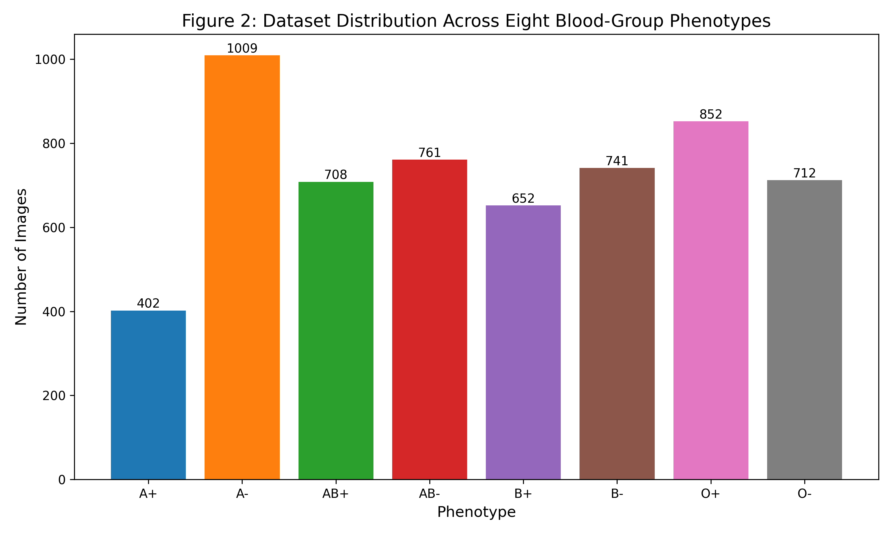
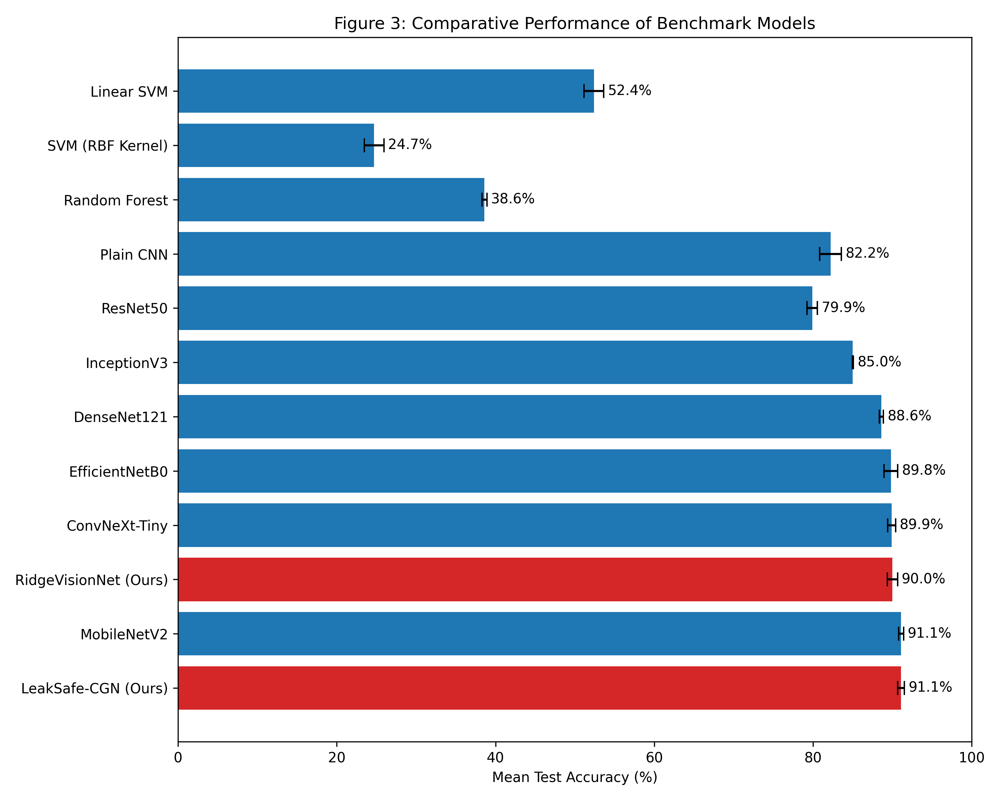
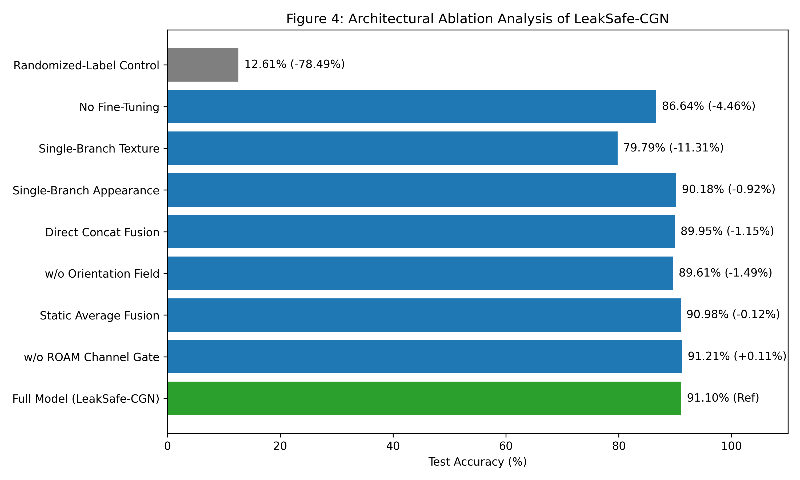
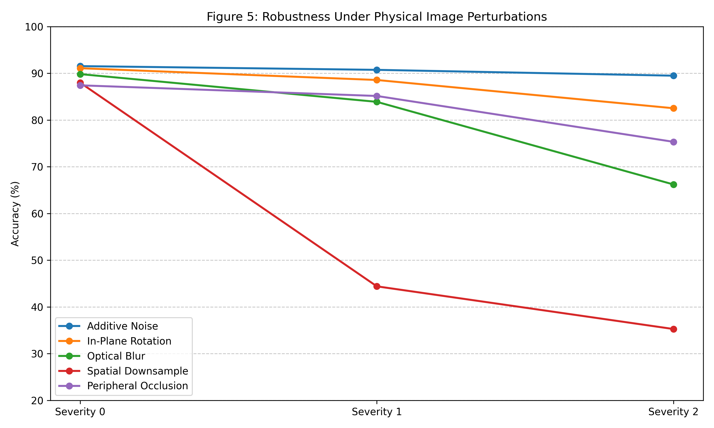
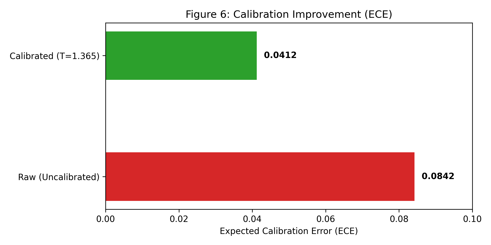

# Manuscript Figures Blueprint

## Figure 1: Overall LeakSafe-CGN Framework Architecture

```text
Fingerprint Image
       │
       ▼
Preprocessing
 ├─ Grayscale
 ├─ Resize
 ├─ CLAHE
 ├─ Gaussian Denoising
 └─ Gabor Filtering
       │
       ├──────────────────────┐
       ▼                      ▼
EfficientNetB0          Texture Features
       │                 ├─ LBP
       │                 ├─ GLCM
       │                 └─ Morphology
       ▼                      │
     CBAM                     ▼
       │                  Dense + LN
       │                      │
       └──────────┬───────────┘
                  ▼
          Feature Concatenation
               1344-D
                  │
                  ▼
          Adaptive Gated Fusion
                  │
                  ▼
             Dense 256
                  │
        ┌─────────┼─────────┐
        ▼         ▼         ▼
      ABO        Rh       Joint
     4-class    Binary    8-class
```

## Figure 2: Dataset Distribution Across Eight Blood-Group Phenotypes


## Figure 3: Comparative Performance of Benchmark Models


## Figure 4: Architectural Ablation Analysis of LeakSafe-CGN


## Figure 5: Robustness Under Physical Image Perturbations


## Figure 6: Calibration and Uncertainty Analysis

